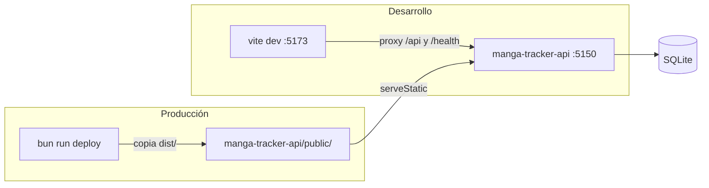

# Cómo se construyó manga-tracker-dashboard

Crónica completa de la construcción del dashboard, paso a paso y en el **orden real** en
que ocurrió (columna vertebral: `git log --oneline --reverse` — tres commits, expandidos
acá en los pasos internos reales de cada uno). Para cada paso: qué se hizo, con qué
comando, por qué en ese momento, qué archivos y funciones aparecieron y qué hace cada
una. Al final, un recetario generalizable para repetir el proceso en otro proyecto.

> **Nota previa sobre "clases":** este código no tiene clases propias. Es React moderno:
> módulos que exportan **componentes-función**, **hooks**, **átomos** y **funciones
> puras**. Las únicas clases instanciadas vienen de las plataformas (`URL`, `Response`,
> `Intl.RelativeTimeFormat`, `Date`). El recorrido va **archivo por archivo, función por
> función** — el equivalente exacto de "clase por clase, método por método".

---

## 0. Visión general: qué es y cómo se sirve

El dashboard es la cara visible del tracker: una SPA React de **solo lectura** (más una
única escritura: corregir el nombre de un manga) que consume la API REST de
`manga-tracker-api`. Tres vistas:

- `/` — la biblioteca: tabla con capítulo alcanzado, última lectura, cantidad de
  lecturas y sitios, con filtros por dominio y antigüedad.
- `/manga/:id` — historial completo de un manga + renombrar.
- `/duplicates` — pares sospechosos de duplicado, para corregir a mano.

**La decisión de arquitectura más importante no es de React: es que NO hay servidor del
dashboard.** El build estático se copia al repo del API (`public/`) y **el propio
backend lo sirve** en `http://localhost:5150/`. Consecuencias en cadena:

1. Mismo origen que la API → los `fetch` son a rutas relativas (`/api/...`) → **no
   existe CORS** para el dashboard.
2. Mismo origen local → no dispara el permiso "acceso a red local" de Chrome 142+.
3. Cero procesos extra corriendo: el LaunchAgent del API ya sirve todo.



El orden de construcción replicó el de la extensión: scaffold → tooling → **contrato con
el API** → estado → utilidades → vistas → tests → publicación.

---

## 1. Paso 1 — Decisiones previas y scaffold (commit `871f365`)

### Qué estaba decidido de antemano y qué hubo que decidir

El PLAN.md del API (roadmap compartido de los tres repos) pineaba el stack: **React 19 +
Jotai + Vite**. Lo que NO pineaba era el router. Se eligió **react-router** (el estándar
de facto; 3 rutas no justifican escribir un router a mano ni traer algo exótico).

**Lección de versiones:** `bun add react-router` instaló la **v8.2.0**, una major más
nueva que lo que uno "sabe de memoria" (v7). Antes de escribir una línea contra esa API
se verificó qué cambió: primero el CHANGELOG oficial, y después la prueba definitiva —
**interrogar al paquete instalado**:

```bash
node -e "const rr = require('react-router'); console.log(['BrowserRouter','Routes','Route','Link','NavLink','useParams','useNavigate'].map(k => k + '=' + (k in rr)))"
```

Resultado: todos los símbolos siguen exportados desde la raíz del paquete → los imports
`from "react-router"` son correctos en v8. Nunca asumas la superficie de una librería
desde la memoria: el `node_modules` que tenés instalado es la verdad.

### Los comandos

```bash
cd ~/Documents/Git
bun create vite manga-tracker-dashboard --template react-ts
cd manga-tracker-dashboard
bun install
bun add jotai react-router
bun add -d @biomejs/biome vitest happy-dom @testing-library/react @testing-library/dom typescript@7
bun remove oxlint          # el template nuevo trae oxlint; acá el linter es Biome
git init -b main
```

### Qué trajo el template y qué se cambió (auditar el template SIEMPRE)

El template `react-ts` de Vite 8 trae: `index.html` (el entry real de Vite),
`src/main.tsx`, un `App.tsx` de demo, tres tsconfigs encadenados y `vite.config.ts`.
Dos sorpresas que obligan a auditar en vez de confiar:

1. **Traía `oxlint`**, no ESLint — se reemplazó por Biome para mantener una sola
   herramienta en los tres repos.
2. **No traía `"strict": true`** en ningún tsconfig (regresión del template). Se agregó
   a mano en `tsconfig.app.json` y `tsconfig.node.json`. Sin strict, la mitad de las
   garantías de TypeScript no existen.

Se borró el demo completo (`App.css`, `src/assets/*`, `public/icons.svg`) y se
reemplazó el favicon por un SVG propio (un libro abierto; con `<title>` interno, que
Biome exige por accesibilidad — lo detectó el primer `lint`).

### Configuración final, archivo por archivo

- **`package.json` → scripts**: `dev` (vite), `build` (vite build), `preview`,
  **`deploy`** (`bun run build && rm -rf ../manga-tracker-api/public && cp -R dist
  ../manga-tracker-api/public` — el paso de publicación completo en una línea), `test`
  (`vitest run`), `lint`/`format` (biome), `typecheck` (`tsc -b`, que sigue las
  referencias de proyectos de los tsconfigs).
- **`vite.config.ts`** — tres cosas: el plugin de React; `server.proxy` que manda
  `/api` y `/health` a `http://localhost:5150` (**el proxy de dev imita a producción**:
  el código usa rutas relativas en ambos modos y no distingue entornos); y la config de
  vitest (`environment: "happy-dom"`, `setupFiles: ["./test-setup.ts"]`) — la primera
  línea `/// <reference types="vitest/config" />` habilita el campo `test` tipado.
- **`biome.json`** — idéntico al de la extensión: `vcs.useIgnoreFile`, preset
  recommended, formatter con espacios, organizeImports.
- **`tsconfig.json`** — solo referencias a `tsconfig.app.json` (el código de `src/` +
  `test-setup.ts`, con lib DOM) y `tsconfig.node.json` (solo `vite.config.ts`).
- **`index.html`** — `lang="es"`, `<title>Manga Tracker</title>`, favicon propio. En
  Vite este archivo ES el entrypoint: el `<script type="module" src="/src/main.tsx">`
  arranca todo.
- **`.gitignore`** — el del template (node_modules, dist, logs, editores).

---

## 2. Paso 2 — La primera pieza de código: el contrato con el API

**Por qué se empezó por acá** (la respuesta a "¿con qué clase comenzaste?"): igual que
en la extensión — todo lo que muestra el dashboard sale del backend, así que tipos +
cliente HTTP van primero y todas las capas siguientes se escriben contra tipos reales.

### `src/api/types.ts` — los DTOs

Interfaces **duplicadas a mano** desde los schemas Zod del API (regla de contrato entre
repos: cambio en el API → este archivo cambia en el mismo commit):

- `MangaDto` — `{id, canonicalName, normalizedSlug, createdAt}`.
- `ReadingEventDto` — un evento de lectura completo (label, número parseado o null,
  URL, dominio, fecha ISO).
- `LibraryEntryDto` — **la proyección** que devuelve `GET /api/library`: por manga,
  `reachedChapter` (número + label del MÁXIMO histórico — tu progreso real),
  `lastActivity` (fecha y label del evento más reciente), `readCount`, `sourceDomains`.
- `MangaHistoryDto` — `{manga, events[]}` (eventos descendentes por fecha).
- `DuplicatePairDto` — `{a, b, similarity}` (similitud 0-1).
- `HealthResponse`, `ErrorResponse`.

### `src/api/client.ts` — el cliente HTTP

- `type ApiResult<T> = { ok: true; data: T } | { ok: false; error: string; status?: number }`
  — misma decisión que en la extensión: **nada lanza excepciones**; el compilador
  obliga a chequear `ok` antes de usar `data`. Toda la UI de error del dashboard cuelga
  de este tipo.
- `request<T>(path, init?)` (interna) — `fetch` a **ruta relativa** (sin base URL: en
  dev el proxy la resuelve, en producción es el mismo origen — el código no sabe en qué
  modo corre). Try/catch para fallos de red; si el status no es 2xx intenta leer
  `{error}` del body (con `.catch(() => null)` para bodies no-JSON) y devuelve
  `{ok:false, error, status}`.
- `getLibrary(filters = {})` — arma el query string con `URLSearchParams` solo con los
  filtros presentes (`domain`, `since` ISO) → `GET /api/library[?...]`.
- `getMangaHistory(id)` — `GET /api/mangas/:id/history` (id con `encodeURIComponent`).
- `updateMangaName(id, canonicalName)` — `PUT /api/mangas/:id` con body JSON. La única
  escritura de todo el dashboard.
- `getDuplicates()` — `GET /api/duplicates`.
- `pingHealth()` — `GET /health`, para el badge de conexión.

Test colocado (`client.test.ts`): `fetch` global mockeado con `vi.stubGlobal`; verifica
la URL exacta con y sin filtros (incluida la codificación `%3A` del ISO en el query), el
PUT con su body, el mapeo de errores con status, el fallback `"HTTP 500"` cuando el body
no es JSON, y el fallo de red.

---

## 3. Paso 3 — Estado global con Jotai (`src/state/atoms.ts`)

Jotai modela estado como **átomos**: valores mínimos independientes que los componentes
leen con hooks; cuando un átomo cambia, solo re-renderiza quien lo lee. Acá hay dos
átomos de filtro y tres de datos:

- `domainFilterAtom = atom("")` — dominio elegido; `""` = todos.
- `sinceDaysAtom = atom<number | null>(null)` — antigüedad en días; `null` = todo.
- `libraryAtom = atomWithRefresh(async (get) => ...)` — **el átomo central**. Es
  asíncrono: su lectura llama `getLibrary` convirtiendo los filtros (días → fecha ISO
  `Date.now() - días`). Como lee (`get`) los dos átomos de filtro, **depende de ellos**:
  cambiás el filtro → jotai re-ejecuta el fetch solo. ¿Por qué `atomWithRefresh` y no
  `atom`? Porque además se necesita refrescarlo **imperativamente** (tras renombrar un
  manga): con `atomWithRefresh`, llamar al setter (`useSetAtom(libraryAtom)()`) re-corre
  el fetch.
- `knownDomainsAtom = atom(async () => ...)` — la lista de dominios para el `<select>`
  del filtro. **Consulta la librería SIN filtros** a propósito: si saliera del resultado
  filtrado, al filtrar por un dominio el select se quedaría solo con ese dominio y no
  podrías volver. Deduplica con `Set` y ordena.
- `duplicatesAtom = atomWithRefresh(async () => getDuplicates())` — refrescable por la
  misma razón (tras renombrar, un par puede dejar de ser duplicado).

**Dónde NO se usó Jotai (decisión deliberada):** el historial del detalle
(`MangaDetailView`) es estado local de una sola vista → `useState` + `useEffect`, sin
átomo. Estado global solo para lo que se comparte entre componentes; lo local se queda
local. No hay dogma de librería.

---

## 4. Paso 4 — Utilidades puras (`src/lib/dates.ts`)

- `relativeDate(iso, now = new Date())` — "hace 3 días", "ayer", "hace 2 semanas".
  Recorre `RELATIVE_UNITS` (año→minuto, cada una con sus milisegundos) y usa la primera
  cuyo tamaño quepa en el tiempo transcurrido, formateando con
  `Intl.RelativeTimeFormat("es", {numeric: "auto"})` (el `"auto"` produce "ayer" en vez
  de "hace 1 día"). Menos de un minuto → "hace un momento". **El parámetro `now` es
  inyectable**: los tests le pasan una fecha fija y son deterministas; producción usa el
  default. Inyectar el reloj es EL truco para testear cualquier cosa que dependa del
  tiempo.
- `formatDate(iso)` — fecha absoluta ("16 jul 2026, 14:05") con
  `Intl.DateTimeFormat("es", {dateStyle:"medium", timeStyle:"short"})`. Se usa en el
  `title` (tooltip) de las fechas relativas del historial.

Ambos formatters se crean una sola vez a nivel módulo (crearlos por llamada es caro).

---

## 5. Paso 5 — Componentes compartidos (`src/components/`)

### `Layout.tsx`

El marco de todas las vistas: barra superior con la marca, la navegación
(`NavLink` de react-router a "Biblioteca" y "Duplicados" — `NavLink` agrega solo la
clase `active` al link de la ruta actual, que el CSS resalta) y el badge de conexión.
Recibe `children` (la vista activa) y lo envuelve en `<main>`.

### `ConnectionBadge.tsx`

- Estado local `Connection = "checking" | "online" | "offline"` con sus etiquetas en
  `LABELS`.
- `useEffect` al montar: define `ping()` (llama `pingHealth()` y setea el estado según
  `result.ok`), la ejecuta ya mismo y la repite cada `PING_INTERVAL_MS = 30_000`. El
  cleanup hace dos cosas SIEMPRE necesarias con efectos así: `clearInterval` y un flag
  `cancelled` para no setear estado en un componente desmontado.

### `RenameForm.tsx`

La corrección manual de nombres (compartida por el detalle y por duplicados). Modela el
formulario como **máquina de estados** con unión discriminada — imposible representar
estados absurdos como "guardando y editando a la vez":

```
FormState = { kind: "idle" }                    → botón "Renombrar"
          | { kind: "editing"; value }          → input + Guardar/Cancelar
          | { kind: "saving"; value }           → igual pero deshabilitado
          | { kind: "error"; value; error }     → igual + mensaje de error
```

- En `idle` renderiza solo el botón que pasa a `editing` con el nombre actual.
- `save()` — trimea (vacío = no hace nada), pasa a `saving`, llama
  `updateMangaName(mangaId, trimmed)`; si `ok` vuelve a `idle` y dispara el callback
  `onRenamed(result.data)` (el padre decide qué refrescar); si no, pasa a `error`
  conservando lo tipeado.
- El submit es un `<form onSubmit>` con `preventDefault` (así Enter también guarda).

Detalle de dominio en el comentario del componente: renombrar solo toca el
`canonicalName` visible; el API jamás toca `normalizedSlug` (la clave de deduplicación),
así el manga sigue matcheando lecturas futuras.

---

## 6. Paso 6 — Las vistas (`src/views/`) y el ensamblado

### `LibraryView.tsx` (`/`)

Tres piezas en un archivo:

- `LibraryView` — el marco: título + `LibraryFilters`, y la tabla adentro de
  `<Suspense fallback="Cargando biblioteca…">`. ¿Por qué Suspense? `libraryAtom` es
  asíncrono: cuando un componente lo lee y aún no hay dato, React "suspende" ese
  subárbol y muestra el fallback; al resolver, renderiza. Cero booleans de loading.
- `LibraryFilters` — los dos `<select>` conectados con `useAtom(domainFilterAtom)` /
  `useAtom(sinceDaysAtom)` (leer + escribir). Las opciones de dominio salen de
  `domainOptionsAtom = unwrap(knownDomainsAtom, (prev) => prev ?? [])`: `unwrap`
  convierte un átomo async en uno síncrono con fallback (acá `[]` mientras carga) —
  así **la barra de filtros nunca suspende** y no parpadea. `SINCE_OPTIONS` define las
  4 opciones de antigüedad (Todo / 7 / 30 / 90 días).
- `LibraryTable` — lee `useAtomValue(libraryAtom)` (acá SÍ suspende). Tres ramas:
  `!result.ok` → mensaje de error con el detalle; lista vacía → estado vacío con
  instrucción ("Abrí un capítulo en un sitio trackeado…"); datos → tabla con nombre
  (`Link` al detalle), `reachedChapter?.label ?? "—"`, última lectura relativa,
  `readCount` y los dominios como chips.

### `MangaDetailView.tsx` (`/manga/:id`)

- `useParams<{id}>` saca el id de la URL.
- Estado local `HistoryState = loading | error{error} | loaded{history}` (unión
  discriminada, no Suspense: es la variante "a mano" para comparar patrones — y porque
  este dato no se comparte con nadie).
- El `useEffect` (re-corre si cambia el `id`): resetea a `loading`, llama
  `getMangaHistory(id)` y setea `loaded` o `error`. El flag `cancelled` en el cleanup
  evita el clásico bug de carrera: si navegás a otro manga antes de que responda el
  primero, la respuesta vieja no pisa a la nueva.
- `applyRename(manga)` — callback para `RenameForm`: actualiza el manga dentro del
  estado local (sin refetch: ya tenemos la respuesta del PUT) **y** dispara
  `refreshLibrary()` (`useSetAtom(libraryAtom)`) porque la proyección cacheada de la
  biblioteca todavía tiene el nombre viejo.
- Render: link "← Biblioteca", título + `RenameForm`, metadatos (slug en `<code>`,
  cantidad de lecturas) y la tabla del historial: label del capítulo, fecha relativa
  (con la absoluta en el tooltip vía `title={formatDate(...)}`), chip del dominio y
  link "Abrir" al capítulo original (`target="_blank" rel="noreferrer"`).

### `DuplicatesView.tsx` (`/duplicates`)

- `DuplicatesView` — marco con la explicación de POR QUÉ no hay botón de merge (los
  eventos son append-only; fusionar moverías historia — la corrección es renombrar) y
  el `Suspense`.
- `DuplicatesList` — lee `duplicatesAtom`; error/vacío/datos como en la biblioteca.
  Cada par renderiza el % (`Math.round(similarity * 100)`), y por cada lado un `Link`
  al detalle + su `RenameForm`. `handleRenamed` refresca **ambos** átomos
  (`duplicatesAtom` y `libraryAtom`): un rename puede disolver el par y además cambia
  la biblioteca.

### `App.tsx` y `main.tsx`

- `App` — `BrowserRouter` → `Layout` → `Routes` con las tres rutas + un `path="*"`
  ("Página no encontrada"). Rutas con historia real del navegador (deep links); el
  servidor colabora sirviendo `index.html` en esas rutas (paso 8).
- `main.tsx` — `createRoot(root).render(<StrictMode><App/></StrictMode>)`, con un
  chequeo explícito de que `#root` existe (regla del repo: nada de `!` non-null).
- `src/index.css` — todo el estilo, a mano (~300 líneas): variables CSS del tema oscuro
  (`--bg`, `--surface`, `--accent`...), topbar, tablas, chips, botones, formulario de
  rename, tarjetas de duplicados. Sin Tailwind ni framework: para una hoja sola, CSS
  plano es menos maquinaria.

---

## 7. Paso 7 — Tests, y la lección de React 19 (dentro del commit `ae1aa56`)

Stack de tests: **vitest** + **happy-dom** (DOM liviano) + **@testing-library/react**
(interactuar como el usuario: por textos y roles, no por internals).

### `test-setup.ts`

Registra `afterEach(cleanup)` de testing-library. Con vitest sin `globals: true`,
testing-library no puede auto-registrar su cleanup — sin esto, cada render queda montado
y contamina el siguiente test.

### `src/test-utils.tsx` — y el bug más instructivo del proyecto

Primer intento: `render()` normal + `await screen.findByText(...)`. Resultado: **tests
colgados en el fallback de Suspense**, y además **aleatorios** (pasaban o fallaban según
el orden de ejecución). El mensaje de React en stderr era la pista:

> "A component suspended inside an `act` scope, but the `act` call was not awaited."

Causa: en React 19, cuando un componente **suspende** durante el render (átomos async),
el `act` que envuelve ese render debe ser **awaiteado** para que React procese la
resolución de la promesa y commitee el árbol; el `render()` síncrono de testing-library
deja el retry encolado para siempre. Fix — dos helpers:

- `renderWithProviders(ui, {route})` — **async**: envuelve el `render` en
  `await act(async () => ...)`, y monta los dos providers que toda vista necesita:
  `<Provider store={createStore()}>` de jotai (un **store nuevo por test** — el store
  default cachea los átomos async y filtraría datos entre tests) y `<MemoryRouter>` (un
  router en memoria, con `initialEntries` para simular la URL).
- `actAsync(interaction)` — envuelve en `act` awaiteado una interacción que dispara
  updates async (cambiar un filtro, guardar el rename).
- `jsonResponse(body, status)` — fabrica `Response` para los mocks de fetch. Detalle
  que muerde: el body de una `Response` es de **un solo uso**; si el mock devuelve
  siempre la misma instancia, el segundo `json()` explota. Por eso los tests usan
  `mockImplementation(() => Promise.resolve(jsonResponse(...)))` — una fresca por
  llamada.

Otra corrección de la misma tanda: `loadable` de jotai (el primer approach para el
select de dominios) está **deprecado** (aviso en consola al correr los tests) → se
migró a `unwrap`, que además simplificó el código.

### Los tests de vistas

- `LibraryView.test.tsx` — render con entradas mock (nombre, "Cap. 1100", chip del
  dominio, link al detalle); el cambio de filtro de dominio dispara un fetch a
  `/api/library?domain=...` (se inspecciona `fetchMock.mock.calls`); estado vacío.
- `MangaDetailView.test.tsx` — el mock de fetch rutea **por URL** (historial, PUT,
  library del refresh); verifica el render del historial, el flujo completo de rename
  (click "Renombrar" → tipear → "Guardar" → el heading nuevo aparece y el PUT salió), y
  el error 404.
- `DuplicatesView.test.tsx` — par con "87 %", y estado vacío.
- `client.test.ts` y `dates.test.ts` — descritos en sus pasos.

Hoy: **22 tests en 5 archivos**, corridos tres veces seguidas para confirmar que la
aleatoriedad murió con el fix de `act`.

---

## 8. Paso 8 — Publicación: `deploy` y el servido same-origin

Del lado del dashboard es un solo comando:

```bash
bun run deploy   # = vite build && rm -rf ../manga-tracker-api/public && cp -R dist …/public
```

Del lado del API (commit `420c908` de ese repo) se agregó el servido con `serveStatic`
de `hono/bun`:

- `/assets/*` y `/favicon.svg` → archivos del build.
- `GET /`, `GET /manga/:id`, `GET /duplicates` → `public/index.html`. **Solo esas tres
  rutas**, nada de wildcard: un deep link a `/manga/abc` (o un F5 ahí parado) recibe el
  index y react-router resuelve del lado del cliente, pero `/api/loquesea` inexistente
  sigue devolviendo su 404 real y `/docs` + `/openapi.json` quedan intactos.
- `public/` está **gitignoreado** en el API: es un artefacto de build, no código.

Como `serveStatic` lee del disco en cada request, re-deployar el dashboard NO requiere
reiniciar el backend. Solo el cambio de `src/index.ts` del API necesitó un reinicio del
LaunchAgent (`launchctl kickstart -k gui/$(id -u)/com.mangatracker`).

Verificación end-to-end que se corrió (contra una instancia en puerto alterno para no
pisar el servicio): `GET /` → HTML, deep link `/manga/abc` → 200 text/html, assets con
su content-type, `/health` y `/api/library` intactos, `/api/nope` → 404.

---

## 9. Paso 9 — Dashboard v2: refresco en vivo, portadas, estados, tags y más

Segunda ronda grande, pedida con el diseño delegado ("como se hace hoy en día"). Todo
lo de este paso vive en el commit `feat(ui): dashboard v2 …` (más su contraparte del
API `feat(api): live stream, covers, …` y una línea en la extensión).

### 9a. Refresco en vivo con SSE (la parte "eficiente")

El requisito era ver el estado real sin recargar y **sin gastar recursos**. La
respuesta correcta para "el servidor avisa, el cliente escucha" es **Server-Sent
Events**, no polling ni WebSockets:

- **Backend**: un bus in-process minúsculo (`events.bus.ts`: un `Set` de listeners con
  `subscribeLibraryChanges`/`publishLibraryChanged`) al que publican TODAS las
  mutaciones de la librería (evento nuevo, portada nueva, rename/estado/tags, delete).
  La ruta `GET /api/events/stream` (`streamSSE` de `hono/streaming`) se suscribe al bus
  y reenvía `library-changed`, con un `ping` cada 30 s para que la conexión idle no se
  cierre; en el abort se desuscribe.
- **Dashboard**: `LiveRefresh` (montado en `Layout`) abre UN `EventSource` — una sola
  conexión HTTP que queda dormida — y al recibir `library-changed` refresca los átomos
  de datos con un debounce de 300 ms (una ráfaga de eventos = un solo refetch).
  `EventSource` reconecta solo si el backend se reinicia. Costo en reposo: cero.
- **Test**: `FakeEventSource` (clase stub que registra instancias y permite emitir
  eventos a mano) + un componente sonda que lee `libraryAtom` — se emite el evento y se
  observa el refetch real.

### 9b. Portadas sin scraping

La extensión ya está parada en la página del capítulo: `coverFromDocument` (en su
`page-signals.ts`) lee `og:image`/`twitter:image`, lo resuelve a URL http(s) absoluta y
lo manda como `coverUrl` opcional del evento. El API lo persiste en `Manga.coverUrl`
(actualiza solo si cambió, incluso en reportes dedupeados). Acá, `CoverImage` lo
muestra con `loading="lazy"` y `referrerPolicy="no-referrer"` (algunos sitios bloquean
hotlinks por referer); si no hay imagen o falla la carga (`onError`), cae a un
gradiente **determinístico por nombre** (hash → hue HSL) con la inicial — cada manga
sin portada se ve distinto pero siempre igual a sí mismo.

### 9c. Estados y tags manuales (la decisión honesta sobre "géneros")

Las páginas de capítulo no declaran los géneros del manga de forma confiable — eso
vive en la ficha del sitio, que la extensión no visita. Adivinar = basura en la DB. Se
optó por lo que hacen los trackers reales (AniList/MAL): **estado de lectura manual**
(`reading | completed | dropped`, columna con default; pestañas en la biblioteca con
"Leyendo" como default, así los terminados no estorban) y **tags manuales** (columna
JSON de strings en SQLite — no hay arrays — editadas con chips en el detalle y
filtrables en la biblioteca). `PUT /api/mangas/:id` pasó a aceptar
`{canonicalName?, status?, tags?}` con un `refine` de "al menos un campo".

### 9d. La biblioteca rediseñada

- **Orden**: la proyección del API ahora sale por `lastActivity` desc (los más nuevos
  primero) y expone `lastSourceUrl` → botón "Seguir leyendo ↗" que abre el último
  capítulo leído.
- **Grilla de tarjetas** (`auto-fill minmax(160px, 1fr)`): portada 3:4 con badge del
  capítulo alcanzado, título clampado a 2 líneas, tiempo relativo, hover sutil.
- **Toolbar sticky**: buscador **insensible a acentos** (`normalize("NFD")` + strip de
  diacríticos: "invocacion" encuentra "Invocación"), segmented control de estados,
  selects de sitio/actividad y chips de tags. Búsqueda/estado/tags filtran **en
  memoria** (la DB es chica; refetchear por tecla sería gastar por nada); solo
  dominio/fecha refetchean.
- **Stats** (spec de stat tile del sistema de diseño: label sentence-case + valor
  semibold en tokens de texto): en lectura, capítulos leídos, sitios, activos de la
  semana — derivadas de `baseLibraryAtom`, el snapshot SIN filtros que también alimenta
  las opciones de dominio y tags (si salieran del resultado filtrado, el select
  colapsaría al filtrar).

### 9e. Detalle y borrado

Cabecera con portada grande + estado + tags + "Seguir leyendo"; historial igual que
antes; y al final la **danger zone**: "Borrar manga…" → confirmación explícita → `
DELETE /api/mangas/:id` (los eventos caen por `onDelete: Cascade`) → vuelta a `/`.
Nació de la experiencia real: las filas basura hasta ahora se borraban por SQL a mano.

---

## 10. Gates y comandos del día a día

- `bun run dev` — vite en :5173 con el proxy al backend (levantá el API antes, o usá el
  LaunchAgent que ya corre).
- `bun run test` / `bunx vitest run <archivo>` — suite completa o un archivo.
- `bun run lint` + `bun run typecheck` + `bun run test` — los tres gates antes de dar
  por terminado cualquier cambio (regla de los tres repos).
- `bun run deploy` — publica a producción local.

Documentación del repo: `README.md` (uso y estructura), `AGENTS.md` (convenciones para
agentes/IA, referenciado por `CLAUDE.md`), `.claude/rules/typescript.md` (reglas de
TypeScript del repo) y este documento.

---

## 11. Recetario: cómo repetir esto en otro proyecto

1. **Cuestioná si necesitás un servidor propio.** Si ya hay un backend, servir el build
   estático desde ahí (same-origin) borra CORS, permisos de red y un proceso entero.
2. **Scaffold con el template oficial, pero auditalo**: mirá qué linter trae, si
   `strict` está activo, qué demo hay que borrar. Primer commit = base adaptada a TUS
   estándares.
3. **Verificá las versiones instaladas contra la realidad** (`node -e "require(...)"`,
   CHANGELOG) antes de escribir código contra una librería que saltó de major.
4. **El contrato con el backend es la primera pieza**: tipos duplicados/generados +
   cliente que devuelve `Result` (unión discriminada), con rutas relativas y un proxy
   de dev que imite producción.
5. **Estado global solo para lo compartido** (filtros, datos que varias vistas
   refrescan); lo local en `useState` con uniones discriminadas. Elegí primitivas que
   soporten "refrescame" si tus datos cambian por acciones del usuario.
6. **Funciones puras con dependencias inyectables** (el `now` de `relativeDate`) =
   tests deterministas gratis.
7. **Formularios como máquinas de estados** (idle/editing/saving/error): el compilador
   elimina los estados imposibles.
8. **Cuando los tests fallan "a veces", el bug es de sincronización**: leé el stderr
   completo (el mensaje de React estaba ahí), entendé el modelo (act + Suspense en
   React 19) y arreglá el helper compartido, no cada test.
9. **El deploy debe ser UN comando** que cualquier futuro-vos pueda correr sin pensar.
10. **Documentá las rutas SPA del lado del servidor explícitamente** (sin wildcard):
    los 404 reales de tu API valen oro para debuggear.
